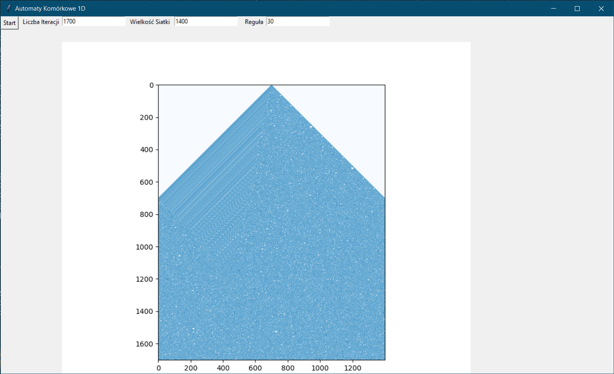
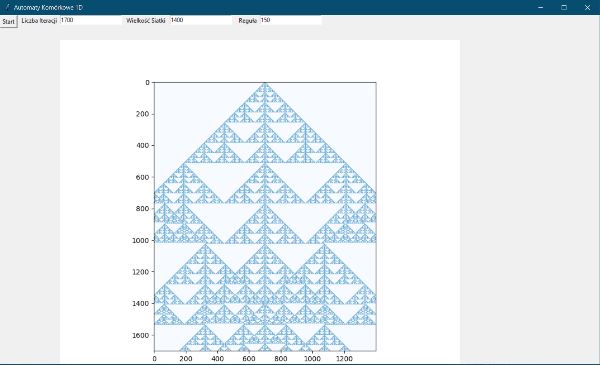
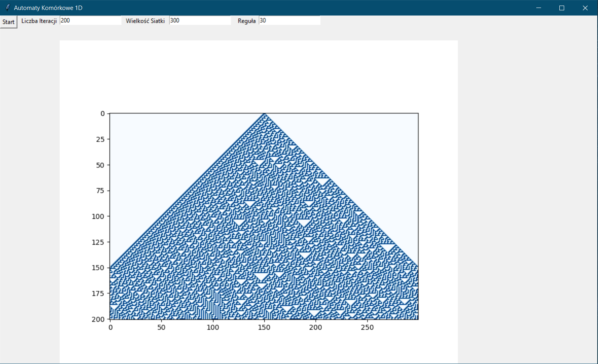
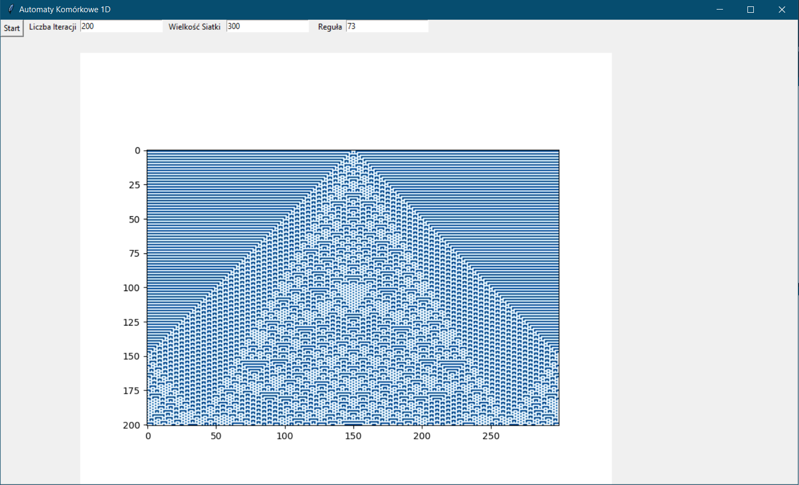

## Cellular automata 1D with gui.
Basic app for calculating and visualising 1D cellular automata using tkinter and matplotlib

App was created as student's project on University

User types number of iterations, size of grid 1D and rule of elementary cellular automation

